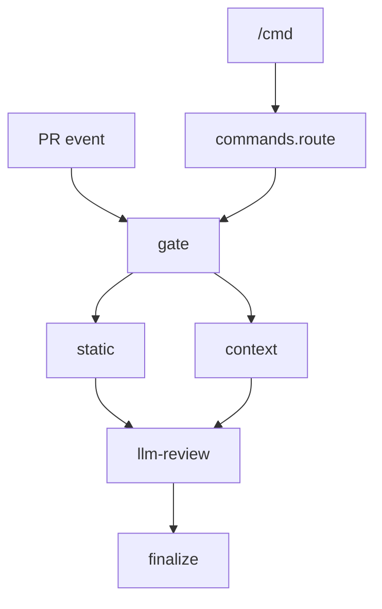

# Repository Guidelines

> Read this whole file first — the single source of truth for **how this repo works**:
> architecture, CI, decisions, and invariants you must not break. `CLAUDE.md` is a symlink; edit
> `AGENTS.md` only. **It is also auto-injected verbatim into every LLM review as a guideline (capped
> at 16 KB/source)** — keep it focused and front-load critical invariants. See *Maintaining this
> file*.

## What this is
A self-hosted, CodeRabbit-style AI PR reviewer that runs **entirely in GitHub Actions** — no backend,
no per-run fees. **No application runtime**: all logic lives in workflow YAML plus a small
`bash`/Python toolkit. 12 pinned static scanners feed an LLM reviewer (the `opencode` agent,
model-agnostic, bring-your-own-key, DeepSeek V4 Pro by default). The LLM only *drafts* findings; a
deterministic bash step *posts* the review, so correctness does not depend on model compliance. State
lives in **one sticky PR comment** — no database.

## Mental model / data flow
`review.yml` is a five-job pipeline. Callers wire `pull_request` events and comment events
(`commands.yml`) into it.

**Where state lives:** one sticky status comment per PR with an embedded `<!-- ai-review:state {json}
-->` marker inside the `<!-- ai-review:ack -->` body (last-reviewed SHA + still-open finding
fingerprints/threadIds). **Only the github-actions-bot's marker is trusted**
(`reconcile_state_from_comments`) — any user could plant a forged one. It must stay parseable by
reconcile's regex `<!-- ai-review:state (?<j>.*?) -->`.

## Project structure & module map
- `.github/workflows/` — `review.yml` (the 5-job pipeline; `workflow_call` only) · `commands.yml`
  (`/review`,`/plan`,`/oc` router; auth-gates + dispatches into `review.yml`) · `ci.yml` (this repo's
  lint/pins/contract/unit on PRs + `main`) · `bump-pins.yml` (weekly tool-pin bumper, one PR/tool) ·
  `release.yml` (dual-trigger release). `dependabot.yml` updates **only** Action `@sha` pins.
- `prompts/` — `review-full.md`/`review-incremental.md` (drafter, mode-specific, intentionally
  incomplete) · `review-common.md` (shared protocol appended to both at compose time) ·
  `review-verify.md` (skeptic; self-contained, NOT appended with common) · `plan.md`. Their `$VAR`
  refs must match workflow `env:` blocks (enforced by `check-contract.py`).
- `scripts/lib/` — **pure, side-effect-free, bats-tested** bash the workflows `source` (no copy
  drift; no network/`gh`/`set` changes — read args/stdin, write stdout): `reconcile.sh`
  (baseline/state/thread reconciliation) · `sarif.sh` (SARIF+shellcheck → `findings.json`) ·
  `context.sh` (impact map → `context.md`) · `cochange.sh` ("you forgot to update X" co-change) ·
  `scope.sh` (`.ai-review.yml` parse, glob match, size counts, stack detect, guidelines render) ·
  `post.sh` (verdict, ≤10 inline budget, anchor validation, compose, state marker) · `pins.sh`
  (**single source of truth for the pinned-tool roster**; sourced by `check-pins.sh` + `bump-pins.sh`).
- `scripts/` — `check-contract.py`, `check-pins.sh` (CI guards), `bump-pins.sh <TOOL>`, `release.sh
  <tag>`. `tests/` — one `.bats` per lib + `tests/fixtures/`. `templates/` — caller workflows.
  `rules/` — extra OpenGrep rule + vendored configs. `Makefile`.

## Architecture deep-dive (the 5 jobs)
Permissions are **per-job** (least privilege); no top-level `permissions:` in `review.yml`. The
privilege-separation spine is the most important design property — preserve it.

- **gate** (`pull-requests:write`, `contents:read`) — resolves the PR, **pins `head_sha`** (later
  jobs check out that SHA, not `refs/pull/N/head`, so a mid-run push can't inject unreviewed code),
  skips drafts, **fetches `.ai-review.yml` + guidelines from the BASE branch** (never PR head), runs
  the size guard, detects `stacks`, reads the state marker, upserts the sticky comment. Auto →
  incremental when a baseline SHA exists else full; explicit `/review` wins. Size guard counts
  non-ignored files and **fires in auto mode only** (`/review` bypasses it).
- **static** (`contents:read`, `security-events:write`) — checks out the pinned head_sha, runs 12
  scanners (opengrep/gitleaks/osv always; the rest gated by detected `stacks`), uploads SARIF, merges
  into `findings.json`. **Config isolation (D5):** every linter is forced to ignore PR-head config
  (`ruff --isolated`, `shellcheck --norc`, `golangci-lint --no-config`, `hadolint -c rules/...`, …)
  so a PR can't silence its own findings. Findings never fail the job; HIGH is always kept (annotated
  `ignoredPath:true`), never dropped.
- **context** (`contents:read`) — builds `context.md`: a per-changed-file impact map (AST-precise for
  py/js/ts/tsx/go/rs/sh, ripgrep fallback) + a recency-weighted co-change section. Honors ignores.
  Best-effort ("leads, not proof") — never fails; caller owns the 60 KB truncation.
- **llm-review** (`contents:read`, `pull-requests:write`, `issues:write` — **deliberately no
  `contents:write`, no persisted credentials**) — three phases:
  1. **drafter** — `opencode run --agent drafter`, **no GitHub token**, locked by inline
     `OPENCODE_CONFIG_CONTENT` (read/glob/grep + restricted git bash only; `edit` ONLY to
     `.ai-review-out/draft.json`); PR-committed `opencode.json*`/`.opencode/` stripped first.
  2. **skeptic** — `opencode run --agent skeptic`, fresh session, optional `verifier_model`/`variant`
     (falls back to `model`/`variant`); refutes each finding, writes `verified.json` (edit only there).
  3. **deterministic post** — workflow bash sources `post.sh`; **the only step with `github.token`**.
     Derives the verdict, applies the ≤10 inline budget, validates anchors against the diff, posts
     ONE review via `gh api`, writes the sticky comment + state marker, via a **3-rung fallback
     ladder** (1 = as-is; 2 = fold inline→minors on a 422 anchor error; 3 = COMMENT + approval notice,
     **only when intended verdict is APPROVE**).
- **finalize** (`contents:write`, `pull-requests:write`) — no LLM; isolates the `contents:write` the
  `resolveReviewThread` mutation needs. Dismisses a superseded `CHANGES_REQUESTED` review on approval
  and resolves bot threads absent from a **fresh, well-formed** state (`reconcile_resolution_gate`);
  APPROVE → empty findings → resolve everything.

**commands.yml** (router) — the job `if:` is the security gate: trigger only when
`comment.user.type != 'Bot'` AND `author_association ∈ {OWNER,MEMBER,COLLABORATOR}`. Commands match
**line-anchored** (`^\s*/review\b`, …). It dispatches `/review[ full]` into `review.yml@<tag>`
(absolute ref, **bumped every release**), `/plan` (issues only), `/oc` (PR or issue, freeform agent,
`persist-credentials:true` because opencode pushes). The `api_key_env` name is validated
(`^[A-Z][A-Z0-9_]{0,63}$`, not `GITHUB_`/`RUNNER_`) before writing to `$GITHUB_ENV`.

## CI & automation
**Run `make check` before pushing.** Four jobs: `lint` (`actionlint`, which bundles shellcheck on
every `run:` block, + `shellcheck scripts/*.sh scripts/lib/*.sh`), `test` (`bats tests/`; needs `bats
jq ripgrep`, `ast-grep` tests self-skip if absent), `contract` (`check-contract.py`, needs `pyyaml`),
`pins` (`CHECK_PINS_OFFLINE=1 check-pins.sh` locally; **CI runs it online** and verifies sha256
against live assets).

Guards enforce:
- `check-contract.py` — (1) every `$VAR` a prompt reads is set by some workflow `env:`; (2) each caller template's permissions are a **superset** of the reusable workflow's (templates can only downgrade); (3) no `gh api … -o` (curl-ism; use `> file`).
- `check-pins.sh` — opencode consistent across its 3 copies; each scanner has one version + one sha256; `OPENGREP_RULES_REF` is a 40-hex commit; all internal `@vX`/`ref: vX` pins share one tag; with `EXPECT_PIN_TAG` set (release), that pin must EQUAL the tag.

Pin automation: `bump-pins.yml` (weekly + manual) opens one PR **per tool**, sha256 recomputed from
the downloaded asset (green by construction). It needs secret `BUMP_PINS_TOKEN` (classic PAT,
`repo`+`workflow`) because pins live inside `.github/workflows/*.yml` and the default `GITHUB_TOKEN`
cannot push workflow-file changes (no `permissions:` key grants it). `release.yml`/`release.sh` are
under *Commit & PR Guidelines*.

## Load-bearing invariants (DO NOT BREAK)
1. **`.ai-review.yml`, guidelines, instructions are read from the BASE branch only**, never PR head — a PR must not scope/silence its own review.
2. **`ignore:` scopes what the AI reviews, never what scanners report.** HIGH static findings are always kept and annotated (`ignoredPath:true`), never dropped.
3. **Untrusted input** (comment/issue bodies, branch names, state JSON) flows via `env:`/`jq`/GraphQL vars — **never interpolated into `run:`** via `${{ }}`.
4. **Privilege separation:** drafter and skeptic get **no GitHub token** and no persisted creds; only the post step holds `github.token`; `contents:write` is isolated in finalize.
5. **Only the bot-authored `<!-- ai-review:state -->` marker is trusted** (`reconcile.sh`); keep the exact spelling + single-line JSON so its capture regex matches.
6. **Inline budget ≤10** blockers/majors, deterministically sorted; overflow → minors. The model must NOT self-cap — that's `post.sh`'s job.
7. **3-rung fallback ladder** ordering + the **APPROVE-only rung-3** gate must hold; non-APPROVE failure past rung 2 must hard-fail.
8. **Pure-lib discipline:** no network/`gh`/`set` changes in `scripts/lib/*.sh`; all I/O stays in the workflow. Keep the deliberate stdin-isolation patterns (fd-3 loops, `</dev/null` on `rg`, temp-file demux) — removing them breaks under `pipefail`/CI.
9. **Pins live only in `pins.sh`** (edit `_pins_data`; both checker and bumper read it). **opencode = 3 copies across `review.yml`+`commands.yml`** — bump together; oxlint uses the `apps_v` `TAG_SELECT`.
10. **The verdict is derived deterministically** (`post_derive_verdict`), never emitted by a prompt — don't add a `Verdict:` line to walkthroughs.
11. **`gh api` has no `-o` flag** (CI-guarded) — capture with `> file`. Guard `grep` extractions in `run:` blocks with `|| true` when a key may be absent (an unguarded miss kills the job under `pipefail`). The `A...B` diff shorthand silently empties without merge-base history — use explicit `git merge-base`.

## Prompt / LLM contract
Drafter prompt = mode playbook (`review-full.md` **or** `review-incremental.md`) **+ `review-common.md`**
appended at compose time (Steps 1.5/4/4.5 + the output contract live only in common — the mode files
are intentionally incomplete and point to it). The skeptic uses `review-verify.md` alone, which
**independently duplicates the JSON schema** — change both or drafter and verifier disagree. Vars are
substituted via `envsubst` with an explicit allowlist; repo `INSTRUCTIONS`/`GUIDELINES_CONTENT` are
appended literally (may contain `$`/backticks).

`draft.json`/`verified.json` per-finding: `{path, line, end_line(null|≥line), side(RIGHT|LEFT),
severity(blocker|major|minor|nit), confidence(high|medium|low), evidence(...), body, tool(null),
rule_id(null)}`; plus top-level `mode`, `walkthrough`, `prior[]`, `dropped_static[]` (CRITICAL/HIGH
static findings the LLM dropped — never silently vanish), and on verified.json a per-finding
`verification` + top-level `rejected[]`. `end_line`/`tool`/`rule_id` must be explicit `null`. Threads
are pre-fetched to `$THREADS_PATH` (agent has no token). `plan.md`: the planner's final chat message
**IS** the issue comment (runner auto-posts) — it must not self-post.

## Caller-facing contract & `.ai-review.yml`
Callers copy `templates/caller-review.yml` (push reviews; fork-guarded) and `caller-commands.yml`,
pin `divkix/ai-review/...@<tag>`, grant the permission superset, and `secrets: inherit` the
`LLM_API_KEY`. Inputs: `model` (`deepseek/deepseek-v4-pro`), `variant` (`max`), `api_key_env`
(`DEEPSEEK_API_KEY`), optional `verifier_model`/`verifier_variant`. `.ai-review.yml` is base-only;
fail-open to defaults with a warning on malformed:

| Key | Type | Default | Meaning |
|---|---|---|---|
| `version` | int | `1` | Schema version; unknown → fail-open with warning. |
| `ignore` | list[glob] | `[]` | Scopes the AI's review surface only (diff/context/findings); HIGH findings still forwarded, marked `ignoredPath`. Simplified glob: `*` crosses `/`; `dist/**`→`dist/*`; slashless patterns also match basename. |
| `max_changed_files` | int | `400` | Size guard (auto only); non-ignored file count. |
| `max_diff_lines` | int | `20000` | Size guard (auto only); non-ignored add+del. |
| `instructions` | list[str] | — | `"<glob> :: <text>"` or plain (repo-wide); ≤500 chars/item; malformed items skipped. Never overrides CRITICAL/HIGH static findings. |
| `guidelines` | str(rel path) | — | Long-form guideline file from base; ≤16 KB; unsafe paths (`/`-leading or `..`) ignored. |
| `auto_guidelines` | bool | `true` | Auto-detect `AGENTS.md`→`CLAUDE.md`→`.cursorrules`→`.github/copilot-instructions.md`→`.windsurfrules`→`.cursor/rules/*.mdc` (case-sensitive, content-deduped, 16 KB/src, 48 KB total). |

Always-on built-in ignores (size guard + impact map): `*.lock`, `*.sum`, `*-lock.json`, `*.min.*`,
`*.svg`, `*.map`. Setup gotcha: enable "Allow GitHub Actions to create and approve pull requests" or
APPROVE degrades to a COMMENT.

## Coding Style & Naming Conventions
- Shell: `bash`, `set -euo pipefail`, 2-space indent, `snake_case`. Keep `# shellcheck disable=` directives immediately above the offending line (actionlint ignores file-top directives).
- Python: 3.12, stdlib + `pyyaml`, 4-space indent, type hints, `snake_case`.
- Workflows: pin actions by commit SHA; pin every fetched tool binary by version **and** sha256 (opencode = 3 copies, update together); OpenGrep rules by commit (`OPENGREP_RULES_REF`). Untrusted input via `env:`. Never read `.ai-review.yml` from PR head. Add/remove pinned tools in `pins.sh` only.

## Testing Guidelines
Add a `bats` case for any change to a `scripts/lib/*.sh` function; name tests `area: scenario ->
expectation`; fixtures in `tests/fixtures/`. **When a workflow `run:` block composes lib output**
(grep/cut/jq chains), pin it with a smoke test under `set -euo pipefail` — the libs' own tests won't
catch consumption/SIGPIPE/`pipefail` bugs (see the gate-block test in `reconcile.bats` and the
`scope`/`post`/`context`/`cochange` smoke tests). Every new `post.sh` helper needs a malformed-input
guard (exit non-zero).

## Commit & Pull Request Guidelines
Use Conventional Commits: `feat:`, `fix:`, `docs:`, `ci:` (see `git log`); imperative subject scoped
to one change; pass CI; note pin/version bumps. **Alpha**: callers pin an exact tag (e.g. `@v0.2.0`),
not a floating major. Release via `release.yml` (**Actions → Release → Run workflow** with the tag:
the `prepare` job's **Resolve release tag** step normalizes the input to one `v` prefix — `0.5.0`
and `v0.5.0` both work — and validates `vX.Y.Z[-pre]`, then runs `release.sh`, commits the pin bump
to `main`, pushes the annotated tag; needs `BUMP_PINS_TOKEN`) or push a tag by hand after
`scripts/release.sh <tag>` locally (the script applies the same `v`-prefix normalization). The tag push runs `make check` + the
`EXPECT_PIN_TAG` guard (the single internal pin must EQUAL the tag) and publishes a Release with
auto-generated notes. `release.sh` auto-updates the README caller-pin pointer (the `currently `@vX``
token); migration notes are not maintained pre-1.0. After tagging, validate with an e2e pass in a
disposable sandbox repo (seeded-bug PR → fix push → `/review full` + `/plan` → size-guard probe).

## Maintaining this file
When you discover a durable fact about this codebase — a new invariant, decision, gotcha, file role,
or workflow change — **append it to the most relevant section here in the same change**, then
**consolidate**: merge duplicates, delete anything made stale, keep it focused. Treat `AGENTS.md` as
the single source of truth for "how this repo works"; never let it drift from the workflows/libs.
Because it is injected verbatim as a review guideline (per-source-capped at 16 KB), keep it under
~16 KB and front-load *Load-bearing invariants* so any tail truncation is harmless. Edit `AGENTS.md`
only (`CLAUDE.md` is a symlink).
