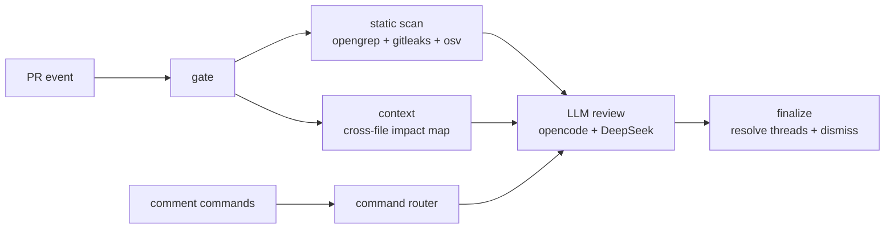

# ai-review

Self-hosted, CodeRabbit-style AI pull request reviewer that runs entirely in GitHub Actions. Static analysis — OpenGrep (AST/SAST), Gitleaks (secrets), and OSV-Scanner (dependency CVEs) — feeds an LLM reviewer (opencode agent + DeepSeek V4 Pro, bring your own key). Zero backend, zero per-run fees: the only costs are GitHub Actions minutes (free for public repos) and DeepSeek tokens.

## How it works

- **Auto full review** when a PR is opened, with one sticky status comment (mode, commit links, trigger, verdict) updated in place — never one comment per push.
- **Incremental review** on each push: reviews only the new commits, then a deterministic `finalize` job resolves fixed review threads via GraphQL and dismisses the bot's stale REQUEST_CHANGES review.
- **Cross-file context**: a `context` job greps the repo for references to every symbol the diff touches and hands the LLM an impact map; the playbook makes the agent verify call sites before judging signature/behavior changes.
- **Noise control**: every finding gets severity + confidence + evidence (scanner-confirmed and caller-verified rank highest), a self-critique pass deletes unproven findings, inline comments are budgeted to 10 blockers/majors, and minors collapse into one `
` block.
- **Draft PRs** get a single "will start when ready" comment and are skipped until marked ready for review.
- **State** lives in a hidden `<!-- ai-review:state ... -->` marker inside the sticky status comment, holding the last reviewed SHA and still-open finding fingerprints/thread ids — no database.

## Commands

| Command | Where | What it does |
|---|---|---|
| `/review` | PR | Incremental review since the last reviewed SHA |
| `/review full` | PR | Full review from scratch (works even if the head SHA was already reviewed) |
| `/plan` | Issues only | Posts a read-only implementation plan comment |
| `/oc <task>` / `/opencode <task>` | PR or issue | Freeform agent: explain, fix, implement; works in inline review comments too |

Only comments from authors with OWNER, MEMBER, or COLLABORATOR association are honored; bot comments are ignored.

## Setup (per target repo)

1. Install the opencode GitHub App ([github.com/apps/opencode-agent](https://github.com/apps/opencode-agent)) on the repo — needed for the `/oc` freeform path (other flows use the workflow `GITHUB_TOKEN`).
2. Copy `templates/caller-review.yml` → `.github/workflows/ai-review.yml` and `templates/caller-commands.yml` → `.github/workflows/ai-review-commands.yml`. Keep the `permissions:` blocks from the templates: reusable workflows can only downgrade the caller's permissions, never elevate them, so the caller job must grant the superset — the review caller needs `contents: write` (required by the `resolveReviewThread` GraphQL mutation that auto-resolves fixed threads — the review never pushes code), `pull-requests: write`, `issues: write`, `security-events: write`; the commands caller additionally needs `id-token: write`. The reusable workflows' per-job permissions then downgrade from these.
3. Add a repo secret `DEEPSEEK_API_KEY` ([platform.deepseek.com](https://platform.deepseek.com)). Note: personal GitHub accounts have no account-wide secrets — add it per repo; orgs can use org secrets.
4. Repo Settings → Actions → General → Workflow permissions: enable **"Allow GitHub Actions to create and approve pull requests"**. Required for the APPROVE verdict; without it, reviews fail to APPROVE and fall back to REQUEST_CHANGES/COMMENT errors.
5. (Optional) Enable Code scanning to see SARIF annotations inline. Uploads are best-effort (`continue-on-error`); the review works without it.

### First run

Open a pull request against the branch your caller workflow watches. Within a minute a sticky **"🔍 ai-review is reviewing this PR…"** comment appears; when the run finishes it's rewritten in place with the verdict, and inline comments (if any) are posted. Push more commits to trigger an incremental review, or comment `/review full` to force a fresh one. On an **issue**, comment `/plan` to get a read-only implementation plan.

## Customization

- **Rules**: drop additional OpenGrep rules into `rules/` in this repo — they are loaded on top of the community pack ([opengrep/opengrep-rules](https://github.com/opengrep/opengrep-rules)). See `rules/example-no-console-log.yaml`.
- **Prompts**: edit the playbooks in `prompts/` (`review-full.md`, `review-incremental.md`, `plan.md`) to tune review behavior, verdict policy, and comment formats.
- **Model**: `deepseek/deepseek-v4-pro`, set in the workflows. Swap by editing `.github/workflows/review.yml` and `commands.yml` — any [models.dev](https://models.dev) provider works with its corresponding env API key. The scaffolding (scanners, context, ranking, lifecycle) is model-agnostic; pointing it at a stronger model is the single biggest review-quality lever.
- **opencode CLI**: pinned by version + sha256 in the workflows (`OPENCODE_VERSION` in `review.yml` ×1 and `commands.yml` ×2). Bump both values together.

## Versioning

Callers pin `@v1`. Tag releases of this repo. When cutting v2, bump every internal `v1`/`@v1` pin:

1. `.github/workflows/review.yml` — tooling checkout `ref: v1` in the `static` job and the `llm-review` job (2 occurrences).
2. `.github/workflows/commands.yml` — tooling checkout `ref: v1`.
3. `.github/workflows/commands.yml` — nested `uses: divkix/ai-review/.github/workflows/review.yml@v1` cross-workflow ref.
4. `templates/caller-review.yml` and `templates/caller-commands.yml` — the `uses: ...@v1` lines in both templates.

## Security model

- Commands are gated by `author_association` (OWNER/MEMBER/COLLABORATOR) and bot comments are rejected.
- Untrusted content (comment bodies, issue titles/bodies, state JSON) is passed via `env:` only — never interpolated into `run:` scripts.
- All third-party actions are pinned to commit SHAs; the opencode CLI is pinned by version + sha256 (no install-latest-at-runtime).
- Privilege separation: the job that feeds untrusted PR content to the LLM runs with `contents: read` (its token cannot push, even if prompt-injected); the `contents: write` required by GitHub's `resolveReviewThread` mutation lives only in the deterministic `finalize` job, which runs no LLM.
- Scanners never fail the build; findings flow to the LLM as data.
- Fork PRs receive no secrets (GitHub default), so the caller template skips them via a `head.repo == repository` condition; a collaborator can trigger `/review` on the PR instead.

## Troubleshooting

- **Review posts a COMMENT/REQUEST_CHANGES instead of APPROVE** — the repo setting in Setup step 4 is off. Enable "Allow GitHub Actions to create and approve pull requests"; the GITHUB_TOKEN cannot APPROVE without it.
- **`finalize` job fails on `resolveReviewThread` with FORBIDDEN** — the caller job isn't granting `contents: write`. Reusable workflows can only downgrade, so the caller in `templates/` must keep the full `permissions:` superset (Setup step 2).
- **Nothing happens when a PR opens** — check the caller workflow is on the PR's base branch, the PR is not a draft (drafts are skipped until "Ready for review"), and the PR is not from a fork (forks get no secrets and are skipped by design; a collaborator can run `/review` instead).
- **`/oc` does nothing** — it needs the opencode GitHub App installed (Setup step 1); the other flows use the workflow token and don't.
- **Review ran but no inline comments / verdict** — the LLM must follow the playbook to post the review and write the `<!-- ai-review:state -->` marker. If the model skips it, `finalize` has no state to act on. Pointing the workflows at a stronger model (see Customization) is the most reliable fix.
- **First run is slow / scans the whole repo** — Gitleaks runs in full git mode on the first pass; subsequent runs are incremental.

## Limitations

- No auto-resolve UI buttons (no "Fix all").
- No cross-PR memory; incremental state is per-PR.
- No diff-size guard or path filters: a very large PR can blow the model's token budget, and there's no per-repo config (no `.coderabbit.yaml`-style include/exclude). Tune scope via the `prompts/` playbooks.
- The `context` job is heuristic identifier grep, not a real call graph — expect occasional false leads, and on large repos the sweep adds latency.
- Review *posting* (inline comments, verdict, state marker) still depends on the LLM following the playbook; only thread resolution/dismissal is deterministic.
- Gitleaks runs in full git mode, so the first run scans the whole repo history.

## License

MIT.
