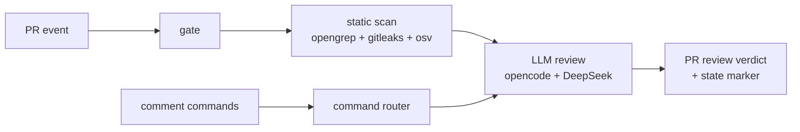

# ai-review

Self-hosted, CodeRabbit-style AI pull request reviewer that runs entirely in GitHub Actions. Static analysis — OpenGrep (AST/SAST), Gitleaks (secrets), and OSV-Scanner (dependency CVEs) — feeds an LLM reviewer (opencode agent + DeepSeek V4 Pro, bring your own key). Zero backend, zero per-run fees: the only costs are GitHub Actions minutes (free for public repos) and DeepSeek tokens.

## How it works

- **Auto full review** when a PR is opened, with a single upserted "🔍 ai-review is reviewing this PR…" ack comment (updated in place on each push, not one comment per push).
- **Incremental review** on each push: reviews only the new commits, resolves fixed review threads via GraphQL, dismisses the bot's stale REQUEST_CHANGES review, and re-verdicts APPROVE or REQUEST_CHANGES.
- **Draft PRs** get a single "will start when ready" comment and are skipped until marked ready for review.
- **State** lives in a hidden `<!-- ai-review:state ... -->` PR comment holding the last reviewed SHA and finding fingerprints — no database.

## Commands

| Command | Where | What it does |
|---|---|---|
| `/review` | PR | Incremental review since the last reviewed SHA |
| `/review full` | PR | Full review from scratch (works even if the head SHA was already reviewed) |
| `/plan` | Issues only | Posts a read-only implementation plan comment |
| `/oc <task>` / `/opencode <task>` | PR or issue | Freeform agent: explain, fix, implement; works in inline review comments too |

Only comments from authors with OWNER, MEMBER, or COLLABORATOR association are honored; bot comments are ignored.

## Setup (per target repo)

1. Install the opencode GitHub App ([github.com/apps/opencode-agent](https://github.com/apps/opencode-agent)) on the repo — needed for the `/oc` freeform path (other flows use the workflow `GITHUB_TOKEN`).
2. Copy `templates/caller-review.yml` → `.github/workflows/ai-review.yml` and `templates/caller-commands.yml` → `.github/workflows/ai-review-commands.yml`. Keep the `permissions:` blocks from the templates: reusable workflows can only downgrade the caller's permissions, never elevate them, so the caller job must grant the superset — the review caller needs `contents: read`, `pull-requests: write`, `issues: write`, `security-events: write`; the commands caller additionally needs `contents: write` and `id-token: write`. The reusable workflows' per-job permissions then downgrade from these.
3. Add a repo secret `DEEPSEEK_API_KEY` ([platform.deepseek.com](https://platform.deepseek.com)). Note: personal GitHub accounts have no account-wide secrets — add it per repo; orgs can use org secrets.
4. Repo Settings → Actions → General → Workflow permissions: enable **"Allow GitHub Actions to create and approve pull requests"**. Required for the APPROVE verdict; without it, reviews fail to APPROVE and fall back to REQUEST_CHANGES/COMMENT errors.
5. (Optional) Enable Code scanning to see SARIF annotations inline. Uploads are best-effort (`continue-on-error`); the review works without it.

## Customization

- **Rules**: drop additional OpenGrep rules into `rules/` in this repo — they are loaded on top of the community pack ([opengrep/opengrep-rules](https://github.com/opengrep/opengrep-rules)). See `rules/example-no-console-log.yaml`.
- **Prompts**: edit the playbooks in `prompts/` (`review-full.md`, `review-incremental.md`, `plan.md`) to tune review behavior, verdict policy, and comment formats.
- **Model**: `deepseek/deepseek-v4-pro`, set in the workflows. Swap by editing `.github/workflows/review.yml` and `commands.yml` — any [models.dev](https://models.dev) provider works with its corresponding env API key.

## Versioning

Callers pin `@v1`. Tag releases of this repo. When cutting v2, bump every internal `v1`/`@v1` pin:

1. `.github/workflows/review.yml` — tooling checkout `ref: v1` in the `static` job and in the `llm-review` job (×2).
2. `.github/workflows/commands.yml` — tooling checkout `ref: v1`.
3. `.github/workflows/commands.yml` — nested `uses: divkix/ai-review/.github/workflows/review.yml@v1` cross-workflow ref.
4. `templates/caller-review.yml` and `templates/caller-commands.yml` — the `uses: ...@v1` lines in both templates.

## Security model

- Commands are gated by `author_association` (OWNER/MEMBER/COLLABORATOR) and bot comments are rejected.
- Untrusted content (comment bodies, issue titles/bodies, state JSON) is passed via `env:` only — never interpolated into `run:` scripts.
- All third-party actions are pinned to commit SHAs.
- `persist-credentials: false` on every checkout.
- Scanners never fail the build; findings flow to the LLM as data.
- Fork PRs receive no secrets (GitHub default), so the caller template skips them via a `head.repo == repository` condition; a collaborator can trigger `/review` on the PR instead.

## Limitations

- No auto-resolve UI buttons (no "Fix all").
- No cross-PR memory; incremental state is per-PR.
- Gitleaks runs in full git mode, so the first run scans the whole repo history.

## License

MIT.
