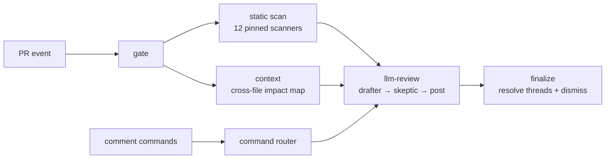

# ai-review

[](https://github.com/Divkix/ai-review/actions/workflows/ci.yml)

Self-hosted, CodeRabbit-style AI pull request reviewer that runs entirely in GitHub Actions. Static analysis (12 pinned scanners — see tool table below) feeds an LLM reviewer (opencode agent, model-agnostic, bring your own key). Zero backend, zero per-run fees: the only costs are GitHub Actions minutes (free for public repos) and LLM tokens (DeepSeek V4 Pro by default; any [models.dev](https://models.dev) provider works).

## How it works



## Static scanners (12 tools)

| Tool | Version | Scope / stack gate | Output | Severity cap |
|---|---|---|---|---|
| [opengrep](https://github.com/opengrep/opengrep) | 1.22.0 | all files | SARIF | uncapped |
| [gitleaks](https://github.com/gitleaks/gitleaks) | 8.30.1 | all files | SARIF | uncapped |
| [osv-scanner](https://github.com/google/osv-scanner) | 2.3.8 | all files | SARIF | uncapped |
| [ruff](https://github.com/astral-sh/ruff) | 0.15.17 | `python` stack (*.py, *.pyi) | SARIF | MEDIUM |
| [golangci-lint](https://github.com/golangci/golangci-lint) | v2.12.2 | `go` stack (*.go + go.mod present) | SARIF | MEDIUM |
| [oxlint](https://github.com/oxc-project/oxc) | 1.69.0 | `jsts` stack (*.js/ts/jsx/tsx/…) | SARIF | MEDIUM |
| [shellcheck](https://github.com/koalaman/shellcheck) | v0.11.0 | `shell` stack (*.sh/bash/bats/…) | json1→findings | MEDIUM |
| [hadolint](https://github.com/hadolint/hadolint) | v2.14.0 | `docker` stack (Dockerfile, Containerfile) | SARIF | MEDIUM |
| [actionlint](https://github.com/rhysd/actionlint) | v1.7.12 | `actions` stack (.github/workflows/*.yml) | SARIF | MEDIUM |
| [zizmor](https://github.com/zizmorcore/zizmor) | v1.25.2 | `actions` stack | SARIF | uncapped (security) |
| [trivy](https://github.com/aquasecurity/trivy) | v0.71.0 | `iac` stack (*.tf, Helm, K8s manifests, docker-compose…) | SARIF | uncapped (security) |
| [typos](https://github.com/crate-ci/typos) | v1.47.2 | all files (universal) | SARIF | LOW |

**Stack detection**: the gate job detects which technology stacks appear in the PR's changed files and emits a `stacks` output (space-separated tokens: `python go jsts shell docker actions iac`). Each language-specific scanner runs only when its stack token is present, saving time on unrelated PRs.

**Config isolation (D5)**: scanners ignore tool config files in the PR head — `ruff --isolated`, `shellcheck --norc`, `golangci-lint --no-config`, `hadolint -c .ai-review-tooling/rules/hadolint.yaml` (vendored neutral config; v2.14.0 has no `--no-config` flag), `oxlint -c $RUNNER_TEMP/oxlint-empty.json` (empty JSON generated at runtime outside the PR tree), `zizmor --no-config`. actionlint's `.github/actionlint.yaml` (runner labels only) is an accepted exception.

**Decided alternates** (not in default roster): kube-linter (K8s best-practice checks; mostly subsumed by trivy's kubernetes scanner — add if callers are K8s-heavy and want probe/resource-limit findings), rumdl (markdown linter; findings are stylistic, lower review-signal — add once the tool stabilizes past 0.2.x), tflint (terraform lint-style checks; terraform slot covered by trivy's security checks — add if callers want deprecated-syntax/unused-declaration findings too).

- **Auto full review** when a PR is opened, with one sticky status comment (mode, commit links, trigger, verdict) updated in place — never one comment per push.
- **Incremental review** on each push: reviews only the new commits, then a deterministic `finalize` job resolves fixed review threads via GraphQL and dismisses the bot's stale REQUEST_CHANGES review.
- **Cross-file context**: a `context` job greps the repo for references to every symbol the diff touches and hands the LLM an impact map; the playbook makes the agent verify call sites before judging signature/behavior changes.
- **Noise control**: every finding gets severity + confidence + evidence (scanner-confirmed and caller-verified rank highest). A dedicated **skeptic/verifier pass** tries to refute each draft finding against the actual code and drops unprovable ones. A **deterministic posting step** (workflow bash, not the LLM) then applies the inline budget (≤10 blockers/majors) and collapses minors into one `<details>` block — posting correctness does not depend on model compliance.
- **Draft PRs** get a single "will start when ready" comment and are skipped until marked ready for review.
- **State** lives in a hidden `<!-- ai-review:state ... -->` marker inside the sticky status comment, holding the last reviewed SHA and still-open finding fingerprints/thread ids — no database.

## Commands

| Command | Where | What it does |
|---|---|---|
| `/review` | PR | Incremental review since the last reviewed SHA |
| `/review full` | PR | Full review from scratch (works even if the head SHA was already reviewed) |
| `/plan` | Issues only | Posts a read-only implementation plan comment |
| `/oc <task>` / `/opencode <task>` | PR or issue | Freeform agent: explain, fix, implement; works in inline review comments too |

Only comments from authors with OWNER, MEMBER, or COLLABORATOR association are honored; bot comments are ignored.

## Setup (per target repo)

1. Install the opencode GitHub App ([github.com/apps/opencode-agent](https://github.com/apps/opencode-agent)) on the repo — needed for the `/oc` freeform path (other flows use the workflow `GITHUB_TOKEN`).
2. Copy `templates/caller-review.yml` → `.github/workflows/ai-review.yml` and `templates/caller-commands.yml` → `.github/workflows/ai-review-commands.yml`. Keep the `permissions:` blocks from the templates: reusable workflows can only downgrade the caller's permissions, never elevate them, so the caller job must grant the superset — the review caller needs `contents: write` (required by the `resolveReviewThread` GraphQL mutation that auto-resolves fixed threads — the review never pushes code), `pull-requests: write`, `issues: write`, `security-events: write`; the commands caller additionally needs `id-token: write`. The reusable workflows' per-job permissions then downgrade from these.
3. Add a repo secret `LLM_API_KEY` (your provider's key; DeepSeek by default — [platform.deepseek.com](https://platform.deepseek.com)). To use a different provider, also set the `model` and `api_key_env` inputs in your caller workflow (see Customization). Note: personal GitHub accounts have no account-wide secrets — add it per repo; orgs can use org secrets.
4. Repo Settings → Actions → General → Workflow permissions: enable **"Allow GitHub Actions to create and approve pull requests"**. Required for the APPROVE verdict; without it, reviews fail to APPROVE and fall back to REQUEST_CHANGES/COMMENT errors.
5. (Optional) Enable Code scanning to see SARIF annotations inline. Uploads are best-effort (`continue-on-error`); the review works without it.

### First run

Open a pull request against the branch your caller workflow watches. Within a minute a sticky **"🔍 ai-review is reviewing this PR…"** comment appears; when the run finishes it's rewritten in place with the verdict, and inline comments (if any) are posted. Push more commits to trigger an incremental review, or comment `/review full` to force a fresh one. On an **issue**, comment `/plan` to get a read-only implementation plan.

## Customization

- **Rules**: drop additional OpenGrep rules into `rules/` in this repo — they are loaded on top of the community pack ([opengrep/opengrep-rules](https://github.com/opengrep/opengrep-rules)). See `rules/example-no-console-log.yaml`. The community pack is pinned to a specific commit (`OPENGREP_RULES_REF` in `review.yml`); bump that value to pick up upstream rule changes.
- **Prompts**: edit the playbooks in `prompts/` (`review-full.md`, `review-incremental.md`, `review-verify.md`, `plan.md`) to tune review behavior, verdict policy, and comment formats. `review-common.md` is the shared protocol appended to both review modes — edit it to change shared policy (classification rubric, state contract). `review-verify.md` is the skeptic/verifier prompt.
- **Model**: set the `model`, `variant`, and `api_key_env` inputs in your caller workflow (see the commented-out `with:` block in the templates) — no fork needed. Default is `deepseek/deepseek-v4-pro` with `variant: max`; any [models.dev](https://models.dev) provider works with its corresponding `api_key_env`. Use `verifier_model` and `verifier_variant` to run the skeptic pass on a different (e.g. stronger or cheaper) model. The scaffolding (scanners, context, ranking, lifecycle) is model-agnostic; pointing it at a stronger model is the single biggest review-quality lever.
- **opencode CLI**: pinned by version + sha256 in the workflows (`OPENCODE_VERSION` in `review.yml` ×1 and `commands.yml` ×2). Bump both values together.

## Per-repo configuration

Place a `.ai-review.yml` file at the root of the **base branch** to tune scope and size limits:

```yaml
version: 1
ignore:
  - "dist/**"
  - "vendor/**"
  - "**/*.pb.go"
  - "docs/generated/**"
max_changed_files: 400    # optional; default 400
max_diff_lines: 20000     # optional; default 20 000
```

You can also provide per-path review instructions and a guidelines file:

```yaml
version: 1
instructions:
  - "api/** :: Flag handlers missing input validation."
  - "Prefer explicit error wrapping."   # no glob -> applies to all files
guidelines: docs/review-guidelines.md
```

**`instructions:`** — a list of review directives. Each item is either `"<glob> :: <text>"` (applies to files matching the glob) or a plain string (repo-wide). Text is truncated to 500 characters per item. Malformed items are skipped individually and do not invalidate the rest of the config.

**`guidelines:`** — a relative path to a long-form review guidelines file in your repo. The file is fetched from the base branch and injected into the review prompt (capped at 16 KB). Unsafe paths (leading `/` or `..` segments) are silently ignored. On fetch failure the field is silently omitted — no hard fail.

Both keys follow the same base-branch trust rule: they are read from the base branch only, never the PR head.

**Where it lives**: the file is read from the **base branch** only, never from the PR head. This closes a threat: a PR author cannot write an `.ai-review.yml` that ignores their own sensitive changes. The config PR itself is reviewed with the old (or absent) config — same behavior as branch protection rules.

**`ignore:` controls what the AI reviews, never what the scanners report.** Scanners (gitleaks, opengrep, osv-scanner) run on everything and their SARIF uploads are always complete. `ignore:` filters: the diff the LLM reads, the cross-file impact map sweep, and findings forwarded to the LLM. HIGH-severity findings from ignored paths are still forwarded, marked `ignoredPath: true`, and surfaced in the walkthrough body.

**Size guard**: auto-triggered reviews (push, PR open) are skipped when the filtered diff exceeds `max_changed_files` or `max_diff_lines`. Filtered counts exclude files matching `ignore:` patterns and built-in generated/lockfile patterns (`*.lock`, `*.sum`, `*-lock.json`, `*.min.*`, `*.svg`, `*.map`). A sticky `<!-- ai-review:too-large -->` comment is posted instead. Explicit `/review` or `/review full` commands always bypass the guard; if the PR is over limit they gain a warning line `⚠️ Large PR (N files / M lines) — token usage may be high.`

**Fail-open**: a malformed or unknown-version `.ai-review.yml` causes the review to run with defaults, with a `⚠️ .ai-review.yml on <branch> is malformed — using defaults.` warning line in the status comment.

**Pattern matching**: patterns use simplified glob matching (bash `case` fnmatch semantics — `*` crosses `/`, `dist/**` → `dist/*`). This covers the common cases; for advanced pathspec matching see `docs/design/pr-scope-config.md`.

## Versioning

**Alpha.** Callers pin an exact release tag (currently `@v0.2.1`), not a floating major — the API is still changing. Tag releases of this repo; when cutting a new one, run `scripts/release.sh <tag>` (bumps every internal pin and re-verifies); locations it touches:

**Migration to v0.1.0**: rename your repo secret `DEEPSEEK_API_KEY` → `LLM_API_KEY`.

1. `.github/workflows/review.yml` — tooling checkout `ref:` in the `static`, `context`, `llm-review`, and `finalize` jobs (4 occurrences).
2. `.github/workflows/commands.yml` — tooling checkout `ref:`.
3. `.github/workflows/commands.yml` — nested `uses: divkix/ai-review/.github/workflows/review.yml@<tag>` cross-workflow ref.
4. `templates/caller-review.yml` and `templates/caller-commands.yml` — the `uses: ...@<tag>` lines in both templates.

## Security model

- Commands are gated by `author_association` (OWNER/MEMBER/COLLABORATOR) and bot comments are rejected.
- Untrusted content (comment bodies, issue titles/bodies, state JSON) is passed via `env:` only — never interpolated into `run:` scripts.
- All third-party actions are pinned to commit SHAs; every fetched tool binary (opencode, opengrep, gitleaks, osv-scanner, ripgrep, ruff, golangci-lint, oxlint, shellcheck, hadolint, actionlint, zizmor, trivy, typos) is pinned by version + sha256, and the OpenGrep community ruleset is pinned to a commit (no install-latest-at-runtime). See `docs/design/pinned-binary-unpinned-data.md` for how scanners that need runtime data (osv advisory DB, trivy misconfig rules, golangci module graph) are handled without breaking the pin invariant.
- Privilege separation: the LLM drafter and skeptic steps run without a GitHub token (they write findings to local files only); the deterministic posting step within `llm-review` and the `finalize` job are the only steps that hold `github.token` and call the GitHub API — no LLM runs in those steps.
- Scanners never fail the build; findings flow to the LLM as data.
- Fork PRs receive no secrets (GitHub default), so the caller template skips them via a `head.repo == repository` condition (`LLM_API_KEY` would be empty); a collaborator can trigger `/review` on the PR instead.

## Troubleshooting

- **Review posts a COMMENT/REQUEST_CHANGES instead of APPROVE** — the repo setting in Setup step 4 is off. Enable "Allow GitHub Actions to create and approve pull requests"; the GITHUB_TOKEN cannot APPROVE without it.
- **`finalize` job fails on `resolveReviewThread` with FORBIDDEN** — the caller job isn't granting `contents: write`. Reusable workflows can only downgrade, so the caller in `templates/` must keep the full `permissions:` superset (Setup step 2).
- **Nothing happens when a PR opens** — check the caller workflow is on the PR's base branch, the PR is not a draft (drafts are skipped until "Ready for review"), and the PR is not from a fork (forks get no secrets and are skipped by design; a collaborator can run `/review` instead).
- **`/oc` does nothing** — it needs the opencode GitHub App installed (Setup step 1); the other flows use the workflow token and don't.
- **Review ran but no inline comments / verdict** — the drafter or skeptic may have written an empty or malformed findings file. Check the `llm-review` job logs for the posting step's output; it will describe why it fell back or skipped. Pointing the workflows at a stronger model (see Customization) improves draft quality.
- **First run is slow / scans the whole repo** — Gitleaks runs in full git mode on the first pass; subsequent runs are incremental.

## Limitations

- No auto-resolve UI buttons (no "Fix all").
- No cross-PR memory; incremental state is per-PR.
- Path filters use simplified glob matching (bash fnmatch, not full gitignore semantics) — advanced patterns like character classes or negation are not supported; see `docs/design/pr-scope-config.md`.
- The `context` job is heuristic identifier grep, not a real call graph — expect occasional false leads, and on large repos the sweep adds latency.
- Review posting (inline comments, verdict, state marker) is deterministic workflow bash (`scripts/lib/post.sh`); the LLM passes write candidate findings files, not GitHub API calls.
- Gitleaks runs in full git mode, so the first run scans the whole repo history.

## Development

There are no live PRs in CI — `.github/workflows/ci.yml` runs four static jobs on every push/PR (no secrets, no DeepSeek). Run them all locally with `make check`:

| Job | What it guards | Run locally |
|---|---|---|
| **lint** | `actionlint` (+ bundled `shellcheck`) on both workflows | `actionlint .github/workflows/*.yml` |
| **pins** | `OPENCODE_VERSION`/`OPENCODE_SHA256` in sync across all copies; each scanner binary (`OPENGREP`, `GITLEAKS`, `OSV_SCANNER`, `RIPGREP`, and 9 new tools) has a single `VERSION` + `SHA256` matching the real release asset; `OPENGREP_RULES_REF` is a 40-char commit; all `vN` pins share one major | `scripts/check-pins.sh` (offline: `CHECK_PINS_OFFLINE=1`) |
| **contract** | every `$VAR` the prompts read is set in a workflow `env:`; caller templates grant a permission superset; the gate's state-marker regex matches `reconcile.sh` | `python3 scripts/check-contract.py` |
| **unit** | the pure lib scripts the workflows source (`scripts/lib/*.sh`) — baseline fallback, state parsing, SARIF merge, cross-file impact map | `bats tests/` |

The review/finalize jobs `source scripts/lib/reconcile.sh` (checked out as `.ai-review-tooling`), so the bats tests exercise the *same* code the workflows run — no copy drift. When bumping the opencode pin, change `OPENCODE_VERSION` **and** `OPENCODE_SHA256` together (all three copies); the **pins** job fails otherwise.

## License

MIT.
